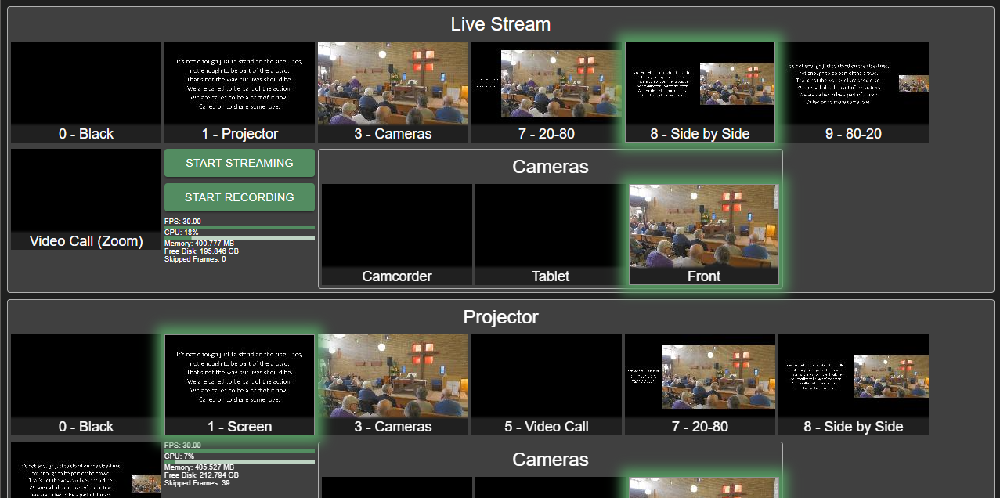

# OBS-tiles

http://obs-tiles.deepcreek.org.au/

OBS-tiles provides a simple interface for switching between scenes in one or more [OBS](https://obsproject.com/) instances using the [OBS-websocket](https://github.com/Palakis/obs-websocket/releases) plugin.

## Screenshot



## Features

## Requirements

- [OBS Studio](https://obsproject.com/) version 27.0.1 or greater.
- [OBS-websocket plugin](https://github.com/Palakis/obs-websocket/releases) version 4.9.1 or greater.
- HTML5 web browser

# Setup

- Load obs-tiles website (eg. http://localhost:1234 during development)
- Click the settings button
- Enter the configuration

# Example configuration

## Simple

This example creates 4 scene tiles, a toggle streaming button, and displays the stats (framerate, cpu, memory, disk space, and skipped frames).

```js
{
  "connections": {
    "liveStream": {
      "address": "192.168.12.56:4444"
    },
  },
  "connection": "liveStream",
  "tiles": [
    {
      "scene": "Blackout"
    },
    {
      "scene": "Screen share"
    },
    {
      "scene": "Camera 1"
    },
    {
      "scene": "Camera 2"
    },
    {
      "button": "toggleStreaming"
    },
    {
      "text": "stats"
    },
  ]
}
```


## Multiple instances of OBS

This example demonstrates connecting to 2 OBS instances.

```js
{
  "connections": {
    "liveStream": {
      "address": "192.168.12.56:4444"
    },
    "projector": {
      "address": "192.168.12.58:4444"
    }
  },
  "tileSize": 18,
  "direction": "column",
  "tiles": [
    {
      "group": "Live Stream",
      "connection": "liveStream",
      "direction": "row",
      "tiles": [
        {
          "scene": "0 - Black"
        },
        {
          "scene": "1 - Projector"
        },
        {
          "scene": "3 - Cameras"
        },
        {
          "scene": "7 - 20-80"
        },
        {
          "scene": "8 - Side by Side"
        },
        {
          "scene": "9 - 80-20"
        },
        {
          "scene": "Video Call (Zoom)"
        },
        {
          "direction": "column",
          "tiles": [
            {
              "button": "toggleStreaming"
            },
            {
              "button": "toggleRecording"
            },
            {
              "text": "stats"
            }
          ]
        }
      ]
    },
    {
      "group": "Projector",
      "connection": "projector",
      "direction": "row",
      "tiles": [
        {
          "scene": "0 - Black"
        },
        {
          "scene": "1 - Screen"
        },
        {
          "scene": "3 - Cameras"
        },
        {
          "scene": "5 - Video Call"
        },
        {
          "scene": "7 - 20-80"
        },
        {
          "scene": "8 - Side by Side"
        },
        {
          "scene": "9 - 80-20"
        },
        {
          "text": "stats"
        }
      ]
    }
  ]
}
```


## Build instructions
### For development

```bash
yarn
yarn start
```
then open http://localhost:1234

### For production
```bash
yarn build
```
Build output is written to the `dist` folder.
