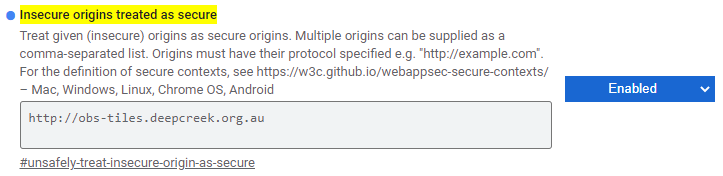
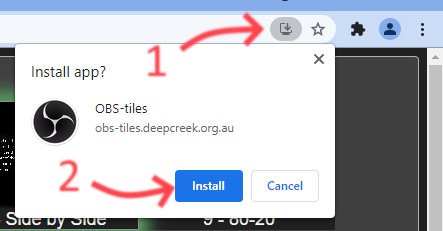
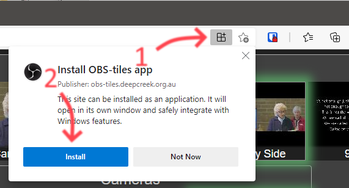
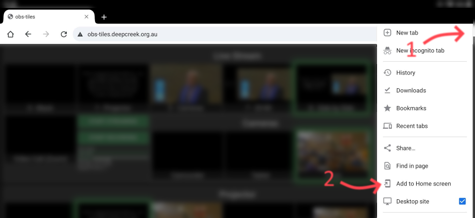
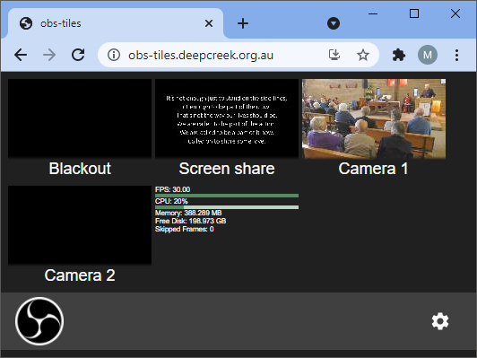

# OBS-tiles

http://obs-tiles.deepcreek.org.au/

OBS-tiles provides a simple interface for controlling one or more [OBS](https://obsproject.com/) instances using the [OBS-websocket](https://github.com/Palakis/obs-websocket/releases) plugin.

## Screenshot


## Features

#### OBS Connections
- Supports multiple OBS instances at once.
- Automatic reconnect for lost connections.
- The password for each connection is stored in browser local storage (not with configuration for security reasons).

#### Not just a website
- Can be installed as a desktop application or added to the home screen of a mobile device.
- Once installed, it does not require an internet connection, so it can be used in a local network that is isolated from the internet.

#### UI
- Flexible configurable of the UI using a JSON configuration.
- Tile size can be configured.
- Every scene button and source button provides a preview of the scene's video content.
- Click/tap a scene to activate it.
- Click/tap a source to toggle it's visibility
  - Combine this with the [source-toggler](https://obsproject.com/forum/resources/source-toggler.860/) script to simulate scene switch between sources.
- Scenes are explicity defined, so you can exclude extra scenes that are not intented for output.
- Start/Stop streaming
- Start/Stop recording
- Can display statistics from OBS (fps, cpu, memory and disk usage, ans skipped frames).


## Requirements

- [OBS Studio](https://obsproject.com/) version 27.0.1 or greater.
- [OBS-websocket plugin](https://github.com/Palakis/obs-websocket/releases) version 4.9.1 or greater.
- HTML5 web browser

## Setup

- Load OBS-tiles website
  - http://obs-tiles.deepcreek.org.au/
  - http://localhost:1234 during development
- Click the settings button
- Enter the configuration

### Installing as a desktop application (from Chrome or Edge)

By default chrome and edge require a website to use https to install it as an application, however if you load the https version of OBS-tiles then it is restricted from accessing an insecure websocket, such as the one OBS-websocket exposes.

In theory a reverse proxy (such as nginx) could be used to get secure access to you OBS websockets, but the easier option is to configure chrome or edge to treat OBS-tiles as secure

- Navigate to [chrome://flags/#unsafely-treat-insecure-origin-as-secure](chrome://flags/#unsafely-treat-insecure-origin-as-secure)
- Enable **Insecure origins treated as secure**
- Enter `http://obs-tiles.deepcreek.org.au` in the text field.\
  
- Relaunch chrome / Restart edge

Once this is done you can proceed to install the application

- Load http://obs-tiles.deepcreek.org.au/
- Click the Install icon in the omnibar and click **Install**\
  \
  Chrome\
  \
  \
  Edge\
  


This will open the app in a new window (*Note: in edge it can take quite a few seconds, so be patient.*), add OBS-tiles to the Apps in the start menu, and for chrome add an OBS-tiles shortcut to the desktop.


### Adding to Home screen (Android/Chrome)

- Load http://obs-tiles.deepcreek.org.au/
- Open the menu in the top right corner and select **Add to Home screen**\
  
- When prompted for the tile name, set it to whatever you want, and click **Add**
- When prompted to place the icon, either touch and hold to drag to the desired location, or click **ADD AUTOMATICALLY**


# Configuration

### Simple example

This example connects to a single OBS instance and creates 4 scene tiles, a toggle streaming button, and displays the stats (framerate, cpu, memory, disk space, and skipped frames).



```js
{
  "connections": {
    "liveStream": {
      "address": "192.168.1.101:4444"
    }
  },
  "connection": "liveStream",
  "tiles": [
    {
      "scene": "Blackout"
    },
    {
      "scene": "Screen share"
    },
    {
      "scene": "Camera 1"
    },
    {
      "scene": "Camera 2"
    },
    {
      "button": "toggleStreaming"
    },
    {
      "text": "stats"
    }
  ]
}
```

## JSON Reference

### `connections`

The `connections` property defines a set of addresses for connecting to OBS.

```js
"connections": {
  "liveStream": {
    "address": "192.168.1.56:4444"
  },
  "projector": {
    "address": "192.168.1.58:4444"
  },
},
```
In this example there are two connections that we have named `liveStream` and `projector`. These names will be referred to in the `connection` properties later.

### `connection`

The `connection` property sets the default connection to use. This name must match one of the connections defined in the `connections` property.

```js
"connection": "liveStream",
```

### `tileSize`

The `tileSize` property sets the size of tiles. This can be overridden in groups and for specific tiles. The default size if not specified is 10.

```js
"tileSize": 12,
```
The tile size is multiplied by 16 and 9 to determine the size of the preview images. A size of 10 results in a preview image of 160x90 pixels. A size of 12 is 192x108. Tile sizes are capped at 20 to limit the bandwidth required to load the preview images.

### `tiles`

The `tiles` property takes an array of objects representing the various tile types (see below).

```js
"tiles": [
  ...tile objects...
]
```

### Tile Types

### `scene`

This loads a tile for a scene, with a preview of the scene's video content.

```js
{
  "scene": "My scene name",
  "title": "Custom title",
  "tileSize": 12,
},
```

| Property | Value |
| -------- | ----- |
| `scene` | The name of the scene. Must match the scene name in OBS. |
| `title` | (optional) Override the title displayed below the tile. |
| `tileSize` | (optional) Override the size of the tile. |


#### `sceneItem`

This loads a tile for a scene item (known as a "source" in OBS), with a preview of the source's video content.

```js
{
  "sceneItem": {
    "scene": 'My scene name',
    "item": 'Source 1',
    "click": "toggleVisible"
  },
  "title": 'Custom title',
  "tileSize": 12,
} ,
```

| Property | Value |
| -------- | ----- |
| `sceneItem.scene` | The name of the scene. Must match the scene name in OBS. This is supplied to determine in which scene the source's visibility will be toggled. |
| `sceneItem.item` | The name of the source in the scene. Must match the source name in OBS. |
| `sceneItem.click` | The action when clicked. Supports "toggleVisible" (default) or "moveToTop". |
| `sceneItem.longpress` | The action when held for longer than 600ms. Supports "toggleVisible" (default) or "moveToTop". |
| `title` | (optional) Override the title displayed below the tile. |
| `tileSize` | (optional) Override the size of the tile. |


### `button`

Displays a button

```js
{
  "button": "toggleStreaming"
},
```

| Property | Value |
| -------- | ----- |
| `button` | Button Type. |

| Button Type | Description |
| ----------- | ----------- |
| `toggleStreaming` | A button that allows streaming to be toggled on and off. |
| `toggleRecording` | A button that allows recording to be toggled on and off. |


### `text`

Displays a block of text.

```js
{
  text: 'stats',
},
```

| Property | Value |
| -------- | ----- |
| `text` | Text type. |

| Text type | Description |
| --------- | ----------- |
| `stats` | Displays statistics from OBS, including fps, cpu, memory and disk usage, ans skipped frames |


### `group`

Provides a container for more tiles.
```js
{
  "group": "Live Stream",
  "connection": "liveStream",
  "tileSize": 12,
  "direction": "row",
  "tiles": [],
}
```

| Property | Value |
| -------- | ----- |
| `group` | (optional) The name of the group.<br /> If this property is omitted then the group will not contain a title or border. This is useful for combining `column` and `row` groups to achieve more complex arrangements of tiles. |
| `connection` | (optional) Override the connection used by child tiles. |
| `tileSize` | (optional) Override the tile size for child tiles. |
| `direction` | (optional) `row` or `column` to determine which direction tiles should be stacked. |
| `tiles` | Array of child tile objects. |


# Example configurations

### Multiple instances of OBS

This example demonstrates:

- Two OBS connections. One is producing a live stream, and the other's output is going to a projector.
- Two groups are created to separate the tiles for each connection.
- An unnamed group is used to combine the buttons and text for the live stream vertically.

This is similar to the screenshot at the top of the page.

```js
{
  "connections": {
    "liveStream": {
      "address": "192.168.1.56:4444"
    },
    "projector": {
      "address": "192.168.1.58:4444"
    }
  },
  "tileSize": 12,
  "direction": "column",
  "tiles": [
    {
      "group": "Live Stream",
      "connection": "liveStream",
      "direction": "row",
      "tiles": [
        {
          "scene": "0 - Black"
        },
        {
          "scene": "1 - Projector"
        },
        {
          "scene": "3 - Cameras"
        },
        {
          "scene": "7 - 20-80"
        },
        {
          "scene": "8 - Side by Side"
        },
        {
          "scene": "9 - 80-20"
        },
        {
          "scene": "Video Call (Zoom)"
        },
        {
          "direction": "column",
          "tiles": [
            {
              "button": "toggleStreaming"
            },
            {
              "button": "toggleRecording"
            },
            {
              "text": "stats"
            }
          ]
        }
      ]
    },
    {
      "group": "Projector",
      "connection": "projector",
      "direction": "row",
      "tiles": [
        {
          "scene": "0 - Black"
        },
        {
          "scene": "1 - Screen"
        },
        {
          "scene": "3 - Cameras"
        },
        {
          "scene": "5 - Video Call"
        },
        {
          "scene": "7 - 20-80"
        },
        {
          "scene": "8 - Side by Side"
        },
        {
          "scene": "9 - 80-20"
        },
        {
          "text": "stats"
        }
      ]
    }
  ]
}
```

### Switching between sources

This example demonstrates:

- Creating a group to switch a scene between 3 different camera sources.
- Two groups are created to separate the tiles for each connection.
- An unnamed group is used to combine the buttons and text for the live stream vertically.

You can see a similar Cameras group in the screenshot at the top of the page.

For this to work correctly it requires setting up the [source-toggler](https://obsproject.com/forum/resources/source-toggler.860/) script in OBS and specifying the `Cameras` scene.


```js
{
  "connections": {
    "liveStream": {
      "address": "192.168.1.56:4444"
    }
  },
  "tileSize": 12,
  "tiles": [
    {
      "group": "Cameras",
      "connection": "liveStream",
      "direction": "row",
      "tiles": [
        {
          "sceneItem": {
            "scene": "Cameras",
            "item": "NDI - AuditoriumCamcorder"
          }
          "title": "Camcorder",
        },
        {
          "sceneItem": {
            "scene": "Cameras",
            "item": "VLC - Tablet camera"
          },
          "title": "Tablet"
        },
        {
          "sceneItem": {
            "scene": "Cameras",
            "item": "Front Camera"
          }
        }
      ]
    }
  ]
}
```


Another approach to switching is to keep all the sources active and toggle which one is on top. The advantages of this approach are that it doesn't require the source-toggler script, and since all the sources stay active the thumbnail previews also stay active.

To achieve this you just set the `"click"` property of each sceneItem to `"moveToTop"`.


```js
{
  "connections": {
    "liveStream": {
      "address": "192.168.1.56:4444"
    }
  },
  "tileSize": 12,
  "tiles": [
    {
      "group": "Cameras",
      "connection": "liveStream",
      "direction": "row",
      "tiles": [
        {
          "sceneItem": {
            "scene": "Cameras",
            "item": "NDI - AuditoriumCamcorder",
            "click": "moveToTop"
          }
          "title": "Camcorder",
        },
        {
          "sceneItem": {
            "scene": "Cameras",
            "item": "VLC - Tablet camera",
            "click": "moveToTop"
          },
          "title": "Tablet"
        },
        {
          "sceneItem": {
            "scene": "Cameras",
            "item": "Front Camera",
            "click": "moveToTop"
          }
        }
      ]
    }
  ]
}
```


## Build instructions
### For development

```bash
yarn
yarn start
```
then open http://localhost:1234

### For production
```bash
yarn build
```
Build output is written to the `dist` folder.
